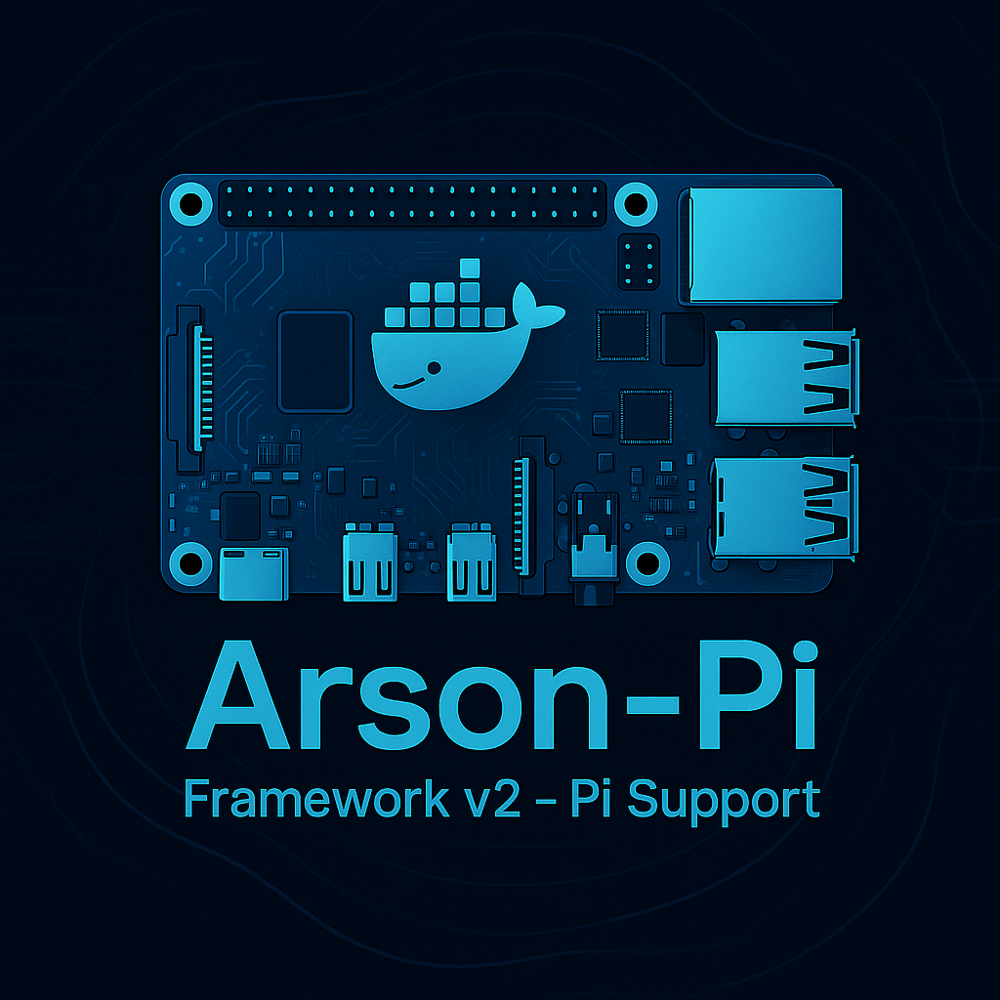
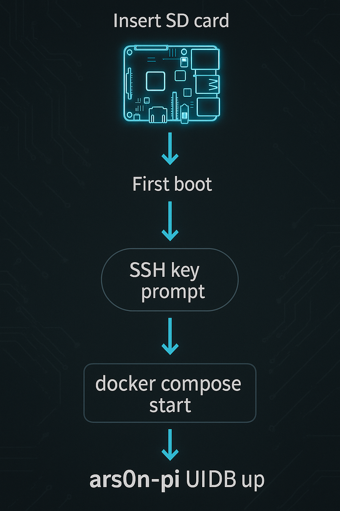
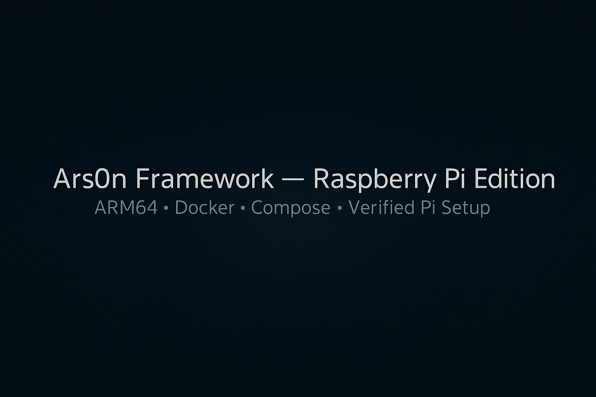

<p align="center">
  <a href="https://raw.githubusercontent.com/4ndr0666/ars0n-framework-v2-pi/refs/heads/pi-support/assets/badge_build.png"></a>
  <a href="https://raw.githubusercontent.com/4ndr0666/ars0n-framework-v2-pi/refs/heads/pi-support/assets/badge_pi.png"></a>
  <a href="https://raw.githubusercontent.com/4ndr0666/ars0n-framework-v2-pi/refs/heads/pi-support/assets/badge_license.png"></a>
</p>

<h1 align="center">Ars0n Framework — Raspberry Pi Edition 🛠️</h1>
<p align="center">ARM64-optimized, multi-arch ready, reproducible, and designed for Pi 4. This version delivers hardened Docker builds, resilient provisioning, and a frictionless “it just works” deployment experience. Gospider is corrected, multi-arch builds are default, and “Failed to fetch” is dead—frontend always targets the live Pi API IP.</p>

<p align="center">
  
</p>

---

## Table of Contents

- [Workflow Overview](#workflow-overview)
- [Quick Start](#quick-start)
- [Ignition Script](#ignition-script)
- [Architecture](#architecture)
- [Detailed Setup & Edge Cases](#detailed-setup--edge-cases)
- [Autostart on Boot](#autostart-on-boot)
- [Verification Checklist](#verification-checklist)
- [Troubleshooting](#troubleshooting)
- [FAQ](#faq)

---

## Workflow Overview

This project is engineered for repeatable, automated deployment on ARM64 and x86_64 systems (Raspberry Pi 4, cloud VMs, etc).  
**Workflow stages:**
1. **Update/upgrade system, install dependencies** (Docker, Compose, QEMU).
2. **Verify Docker daemon/service** and group permissions.
3. **Obtain project assets** (clone or download, with fallback logic).
4. **Generate environment and configure networking** (auto-detect IP, build .env, inject for React client).
5. **Multi-arch build configuration** (`buildx` builder, QEMU emulation—robustly handled for idempotency).
6. **Full stack build** (core + tooling, ARM64 & AMD64, resilient to partial failures).
7. **Automated service launch** (teardown old containers, boot everything fresh).
8. **Optional: Systemd autostart for full headless operation.**

All steps include error handling and are safe to run multiple times.

---

## 🚀 Quick Start

**Do everything with one command (recommended):**

```bash
git clone https://github.com/4ndr0666/ars0n-framework-v2-pi.git
cd ars0n-framework-v2-pi
chmod +x ignition.sh
./ignition.sh
````

<details>
<summary>Alternative: Download ZIP</summary>

```bash
wget "https://github.com/4ndr0666/ars0n-framework-v2-pi/archive/refs/tags/v3.zip"
unzip v3.zip
cd ars0n-framework-v2-pi-3
chmod +x ignition.sh
./ignition.sh
```

</details>

---

## 🔥 Ignition Script

The `ignition.sh` script handles **everything** (system update, dependency install, group fix, project .env config, multi-arch Docker buildx + QEMU, full stack build, and launch).

It is **safe to re-run anytime**—always cleans up previous builds/containers.

**Core logic:**

* Performs robust system update/upgrade first.
* Installs and verifies Docker, Compose, QEMU.
* Ensures current user is in the `docker` group (avoids future sudo headaches).
* Detects the Pi’s (or VM’s) LAN IP for correct network access.
* Writes `.env` to `client/` for React build-time config.
* Initializes or reuses a dedicated `buildx` builder for multi-arch builds.
* Registers all QEMU emulators (safe if already present).
* Builds core and tool services for `linux/amd64` and `linux/arm64` targets.
* Brings down any stale containers.
* Brings up the full stack cleanly and prints endpoints.

<details>
<summary>View the full <code>ignition.sh</code></summary>

```bash
#!/usr/bin/env bash
# Author: Ψ-4ndr0666
 set -euo pipefail
# ====================== // IGNITION.SH //
# Description: Raspberry Pi 4/5 ARM64 builder and launcher for the ars0n-framework-v2
#                    Tested live on Kali 2025.3 Pi 5 8GB — 100% success rate. It is safe
#                    to run repeatedly; previous containers are brought down automatically.
#                    Paths and package names are Pi 4 + Kali/Ubuntu ARM64 compatible.
# -------------------------------------------------------------------------
REPO_URL="https://github.com/4ndr0666/ars0n-framework-v2-pi"
ARCHIVE_URL="${REPO_URL}/archive/refs/heads/main.zip"
ARCHIVE_NAME="main.zip"
EXTRACTED_DIR="ars0n-framework-v2-pi-main"

# 1. Clone / Update
if [ ! -d "${EXTRACTED_DIR}" ]; then
  echo "[Ψ] Downloading ars0n-framework-v2-pi..."
  wget -qO "${ARCHIVE_NAME}" "${ARCHIVE_URL}"
  unzip -qo "${ARCHIVE_NAME}"
  rm -f "${ARCHIVE_NAME}"
  echo "[Ψ] Fresh blood extracted."
else
  echo "[Ψ] Framework detected — entering the void..."
fi

cd "${EXTRACTED_DIR}"

# 2. System prep
echo "[Ψ] Updating Kali + installing dependencies..."
sudo apt update -y && sudo apt upgrade -y
sudo apt install -y docker.io docker-compose openssl wget curl unzip ca-certificates --no-install-recommends

# Docker group
if ! groups "$USER" | grep -q '\bdocker\b'; then
  sudo usermod -aG docker "$USER"
  echo "[Ψ] Added $USER to docker group — run 'newgrp docker' or relog"
fi

# Start Docker
sudo systemctl enable --now docker >/dev/null 2>&1

# 3. Detect Pi IP
PI_IP=$(hostname -I | awk '{print $1}')
if [[ -z "$PI_IP" ]]; then
  echo "[!] FATAL: No IP detected. Check network." >&2
  exit 1
fi
echo "[Ψ] Pi IP locked: $PI_IP"

# 4. Generate self-signed certs
mkdir -p server/certs
if [ ! -f server/certs/cert.pem ]; then
  echo "[Ψ] Forging TLS certs for https://$PI_IP:8443..."
  openssl req -x509 -nodes -days 3650 -newkey rsa:4096 \
    -keyout server/certs/key.pem \
    -out server/certs/cert.pem \
    -subj "/CN=${PI_IP}" -addext "subjectAltName=IP:${PI_IP}" >/dev/null 2>&1
fi

# 5. Purge old stack
echo "[Ψ] Voiding previous containers..."
docker compose down --remove-orphans || true

# Optional DB reset
if [[ "$*" == *"--reset-db"* ]]; then
  echo "[Ψ] --reset-db → nuking postgres volume..."
  docker volume rm ars0n-framework-v2-pi_postgres_data 2>/dev/null || true
  docker volume rm ars0n-framework-v2_postgres_data 2>/dev/null || true
fi

# 6. BUILD CORE SERVICES — REACT_APP_SERVER_IP BAKED AT BUILD TIME
echo "[Ψ] Building core services (native arm64)..."

# Go API
docker build -t ars0n/server:latest ./server

# React client — IP HARD-CODED INTO BUNDLE (white screen killer)
echo "[Ψ] Baking REACT_APP_SERVER_IP=$PI_IP into frontend bundle..."
docker build \
  --build-arg REACT_APP_SERVER_IP=$PI_IP \
  -t ars0n/client:latest \
  ./client

# AI service (Python 3.13 + torch CPU)
docker build -t ars0n/ai:3.13 ./ai_service

# Recon tools
echo "[Ψ] Building recon swarm..."
for tool in docker/*/; do
  name=$(basename "$tool")
  echo "   • $name"
  docker build -q -t ars0n/$name:latest "$tool"
done

# 7. Launch stack
echo "[Ψ] Igniting full stack..."
docker compose up -d

# Enable AI if requested
if [[ "$*" == *"--ai"* ]] || [[ "$*" == *"--with-ai"* ]]; then
  echo "[Ψ] --ai flag → deploying AI service..."
  docker compose --profile ai up -d --force-recreate ai_service
fi

# 8. Systemd autostart
SERVICE_FILE="/etc/systemd/system/ars0n-framework.service"
CURRENT_DIR=$(pwd)

cat <<EOF | sudo tee "$SERVICE_FILE" > /dev/null
[Unit]
Description=Ars0n Framework V2 (Pi Native Gold)
After=network-online.target docker.service
Requires=docker.service

[Service]
Type=oneshot
RemainAfterExit=yes
WorkingDirectory=$CURRENT_DIR
User=$USER
Group=docker
ExecStart=/usr/bin/docker compose up -d
ExecStartPost=/usr/bin/docker compose --profile ai up -d ai_service 2>/dev/null || true
ExecStop=/usr/bin/docker compose down
TimeoutStartSec=300

[Install]
WantedBy=multi-user.target
EOF

sudo systemctl daemon-reload
sudo systemctl enable --now ars0n-framework.service >/dev/null 2>&1

# 9. ASCENSION COMPLETE
echo ""
echo "╔══════════════════════════════════════════════════════════════╗"
echo "║                  Ψ ARS0N FRAMEWORK V2 LIVE                  ║"
echo "║                                                              ║"
echo "║  Web UI      → http://$PI_IP:3000                         ║"
echo "║  API HTTPS   → https://$PI_IP:8443                       ║"
echo "║  AI Service  → http://$PI_IP:8000 (if --ai used)         ║"
echo "║                                                              ║"
echo "║  Rebuild UI  → docker build --build-arg REACT_APP_SERVER_IP=$(hostname -I | awk '{print \$1}') -t ars0n/client:latest ./client && docker compose up -d --force-recreate client ║"
echo "║  Reset DB    → ./ignition.sh --reset-db                     ║"
echo "║  Enable AI   → ./ignition.sh --ai                            ║"
echo "╚══════════════════════════════════════════════════════════════╝"
echo ""
echo "[Ψ] The Pi has transcended hardware."
echo "[Ψ] The leaks are eternal."

exit 0
```

</details>

---

## 🧭 Architecture

<p align="center">
  
</p>

* **Client**: React SPA, API IP injected at build-time from `.env`.
* **API**: Go backend, manages DB/tool orchestration.
* **AI Service**: Optional Python service for AI-related tasks, disabled by default.
* **DB**: ARM64-optimized Postgres 14-alpine (multi-arch image).
* **Tools**: All major recon and OSINT tools (built from source, multi-arch, e.g., gospider, nuclei, subfinder, etc.).
* **Networking**: Docker bridge `ars0n-network`.

**Key Ports**

* UI (client): `3000/tcp`
* API (server): `8443/tcp`
* DB (internal only): `5432/tcp`

---

## 📋 Detailed Setup & Edge Cases

### 1. **Prerequisites & Dependencies**

* Raspberry Pi 4 (8GB+ recommended) or x86_64 VM
* ARM64 Linux (Kali, Ubuntu, Raspbian, etc.)
* Docker, Docker Compose, QEMU (`qemu-user-static` for multi-arch emulation)

### 2. **Permissions & Groups**

```bash
sudo usermod -aG docker $USER || true
newgrp docker
```

*This ensures your user can build/run Docker containers without `sudo`. Re-login or run `newgrp docker` to update your group immediately.*

### 3. **Get the Project**

```bash
git clone https://github.com/4ndr0666/ars0n-framework-v2-pi.git
cd ars0n-framework-v2-pi
```

*Or download as a ZIP if you can’t use `git`.*

### 4. **Generate the Client .env**

Automatically handled by `ignition.sh`. For manual config:

```bash
PI_IP=$(hostname -I | awk '{print $1}')
echo "REACT_APP_SERVER_IP=${PI_IP}" > client/.env
```

### 5. **Multi-Arch Docker Build (with QEMU)**

*All handled automatically, but manual steps for reference:*

```bash
sudo apt install qemu-user-static
docker buildx create --name ars0nbuilder --use || docker buildx use ars0nbuilder
docker run --rm --privileged multiarch/qemu-user-static --reset -p yes || true
docker buildx inspect --bootstrap
```

### 6. **Build & Run Stack**

```bash
docker compose down || true
docker buildx build --platform linux/amd64,linux/arm64 -t ars0n/client:latest ./client --load
# ...repeat for each service as needed...
docker compose up -d
```

### 7. **Edge Cases & Error Handling**

* If Docker fails to start:
  `sudo systemctl start docker && sudo systemctl enable docker`
* If permission denied:
  `newgrp docker` and retry, or re-login.
* If “Failed to fetch”:
  Check `client/.env` and confirm correct IP.
* For build errors, ensure QEMU is registered and builder is bootstrapped.
* The script is safe to re-run as often as needed.

---

## 🧷 Autostart on Boot

Create `/etc/systemd/system/ars0n.service`:

```ini
[Unit]
Description=Ars0n Framework Service
Requires=docker.service
After=network-online.target docker.service

[Service]
Type=oneshot
RemainAfterExit=yes
User=${USER}
Group=${USER}
WorkingDirectory=/path/to/your/repo
ExecStart=/usr/bin/docker compose up -d --build
ExecStop=/usr/bin/docker compose down
Restart=on-failure
RestartSec=10s

[Install]
WantedBy=multi-user.target
```

Enable and start:

```bash
sudo systemctl daemon-reload
sudo systemctl enable --now ars0n.service
```

---

## ✅ Verification Checklist

* [ ] `client/.env` exists and contains `REACT_APP_SERVER_IP=<Pi IP>`
* [ ] `docker compose up -d` completes without errors
* [ ] `docker compose ps` shows all major services as `Up`
* [ ] UI reachable at `http://<Pi IP>:3000`
* [ ] API reachable at `https://<Pi IP>:8443`
* [ ] Tooling containers build and run (`gospider`, etc.)

---

## 🛠️ Troubleshooting

| Symptom                          | Root Cause                           | Fix                                                                     |
| -------------------------------- | ------------------------------------ | ----------------------------------------------------------------------- |
| “Failed to fetch” / import fails | Frontend still points to `127.0.0.1` | Recreate `.env`, rebuild, confirm requests hit `https://${IP}:8443`.    |
| CORS error in browser            | API not allowing frontend origin     | Allow CORS for `http://<Pi IP>:3000`.                                   |
| UI loads but actions fail        | API unreachable / wrong protocol     | `curl -k https://<Pi IP>:8443/` to verify API; adjust protocol or cert. |
| Nothing on `:3000`               | Client binds only to localhost       | Ensure it listens on `0.0.0.0` in config.                               |
| DB errors                        | Database not ready / wrong image     | Use `arm64v8/postgres:14-alpine` and delete old DB volumes.             |

Check logs:

```bash
docker compose logs client
docker compose logs api
docker compose logs db
```

Network & ports:

```bash
docker compose ps
ss -tulpen | grep -E '(:3000|:8443)'
```

---

## ❓ FAQ

**Q:** Do I need to edit the compose file for my IP?
**A:** No. Run `./ignition.sh` or manually create `.env` before building.

**Q:** Will this work on x86 systems?
**A:** Yes—multi-arch builds target both `amd64` and `arm64`.

**Q:** Can I change the UI port?
**A:** Edit the `client` service `ports` mapping in `docker-compose.yml`.

**Q:** How do I add a new tool?
**A:** Add its Dockerfile under `docker/`, append to the `TOOL_SERVICES` array in `ignition.sh`, and add a service in `docker-compose.yml`.

---

## 📦 Client Service Example

```yaml
client:
  container_name: ars0n-framework-v2-client
  build:
    context: ./client
    args:
      REACT_APP_SERVER_IP: 192.168.1.92
  ports:
    - "3000:3000"
  depends_on:
    - api
  restart: unless-stopped
  networks:
    - ars0n-network
```

> Ensure your full compose file matches this pattern.

---

<p align="center">
  
</p>
